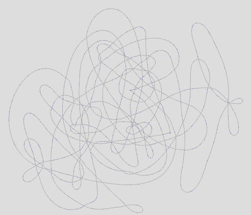

Spaghetti is a web-based visualization tool for visualizing sequencing read assembly and contig scaffolding. You can view edge-overlaps between segments and adjust alignment  thresholds to help resolve the (hopefully linear) structure of adjacent pieces. Spaghetti is compatible with several common alignment formats, including:

-  [MAF](https://cgwb.nci.nih.gov/FAQ/FAQformat.html#format5) (output by LAST and others)</li>
-  m4 (output by blasr)</li>
-  [SAM](http://samtools.github.io/hts-specs/SAMv1.pdf) (output by Bowtie and others)</li>

Spaghetti uses force-directed layout to iteratively improve the alignment graph layout. There are two modes which the visualization transitions seemlessly between depending   on the size of the graph. For large graphs (>1000 edges), a non-interactive but navigable graph is shown and the user may zoom in and out, and drag the viewport around to        inspect the graph. For smaller graphs, the viewport is fixed but node (read/contig) labels may be shown, and individual nodes may be dragged around. Additionally, if you click a node, all adjacent nodes (according to the edge filtering criteria) are highlighted, and successive nodes may be clicked to show  the segment overlaps below.

To view your own alignment file, simply drag and drop the file onto the dashed box below. The file will be loaded locally (not on our server) and displayed. You may also try  our sample data by clicking on of the two (one large, one small) datasets below the drop box. Drag the sliders to adjust the edge filtering thresholds and the graph will be redrawn to reflect the new subset of edges.

For SAM files, partial query alignments are not common, so paired-end reads will be treated as one read, with each end used to create multiple alignments.

Spaghetti visualization of [E. coli K12 PacBio self-assembly] (http://nbviewer.ipython.org/github/cschin/Write_A_Genome_Assembler_With_IPython/blob/master/Write_An_Assembler.ipynb) early in its force-directed layout resolution.

Spaghetti was developed by Jeremy Wang at the University of North Carolina at Chapel Hill.

If you have questions, comments, problems, or suggestions, create an issue or pull request and we will look into it.
